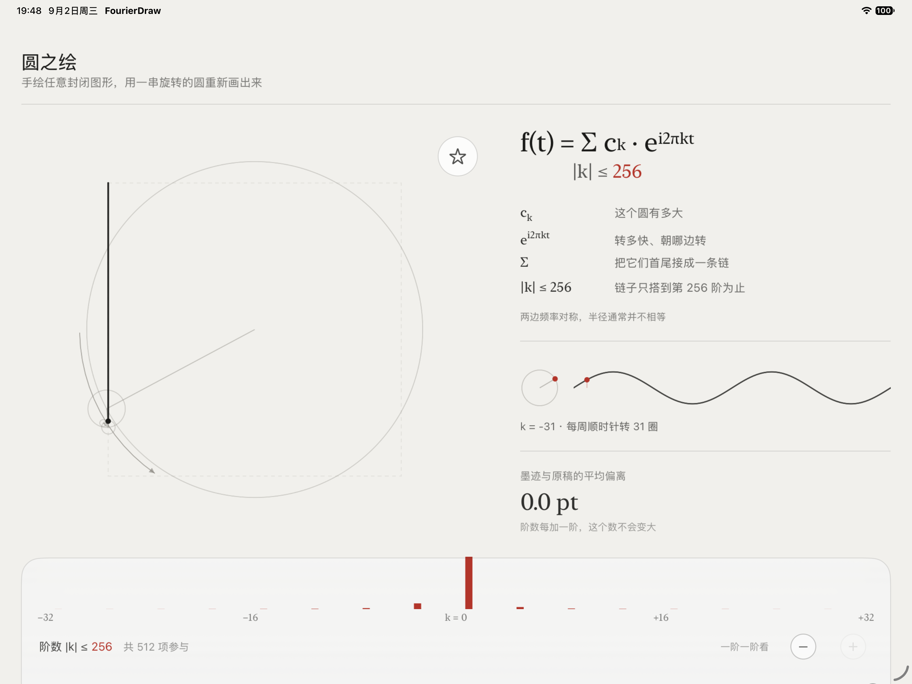

# FourierDraw

> 把一条手绘曲线，拆成一串正在旋转的圆。

FourierDraw 是一个离线运行的 iOS 数学教具。用户手绘一个封闭图形，应用将路径重采样并进行离散傅里叶变换，再用按频率排列的旋转圆链实时重建原图。

它把抽象的傅里叶级数变成可以直接观察和操作的过程：每个圆代表一个频率分量，圆的半径代表振幅，旋转方向和速度代表频率，最后一个圆的笔尖轨迹就是合成结果。

## 应用预览



上图展示了 iPad 横屏下的主界面：左侧是圆链和重建轨迹，右侧是公式、单项频率波形与误差说明，底部是频谱和阶数控制。

## 功能亮点

- 手绘、清空与预设图形
- 傅里叶圆链动画与实时笔尖轨迹
- 频率阶数滑块、频谱展示和公式拆解
- 误差指标，帮助观察低阶到高阶的逼近过程
- 首次使用引导、预设图形与 iPad 横竖屏布局
- 低档 / 高档性能配置，适配不同设备
- 完全离线运行，无网络请求和外部服务

## 快速开始

1. 使用正式版 Swift Playgrounds 打开 `FourierDraw.swiftpm`。
2. 运行 App Playground。
3. 在画布中绘制一个闭合图形，或从预设菜单选择图形。
4. 拖动底部阶数控制，观察圆链从低频轮廓逐步还原细节。

建议先从简单图形开始，再尝试带有尖角或细节的路径，更容易观察不同频率分量对最终形状的影响。

## 目录结构

```text
FourierDraw.swiftpm/
├── Math/       复数、DFT、重采样与轨迹缓存
├── Motion/     动画相位
├── Perf/       性能档位
└── Views/      画布、公式、滑块、频谱和引导界面
docs/           PRD、实现参考、V2 规格与设计资料
output/         打包文件、预览图和项目说明 PDF
```

## 数学约定

- 采样数 `N = 512`。
- 频率映射为 `freq = (k < N/2) ? k : k - N`，频率范围是 `−256…255`。
- 滑块按 `|freq| ≤ M` 截断，`M` 的范围为 `1…256`。
- 圆链顺序为 `0, +1, −1, +2, −2, …`。
- 输入路径会翻转 y 轴，使数学坐标系向上。

## 开发说明

这是 Swift Playgrounds App 项目。请优先在 Swift Playgrounds 中验证，不要手动修改自动生成的 `Package.swift`，也不要引入额外 SPM 依赖。

本地构建可能因命令行环境缺少 Swift Playgrounds 专用的 `AppleProductTypes` 模块而无法执行；正式验证应使用 Swift Playgrounds 打开并运行项目。

## 规格资料

- [项目 PRD](docs/FourierDraw_PRD.md)
- [实现参考](docs/FourierDraw_IMPLEMENTATION_REFERENCE.md)
- [V2 使用说明](docs/V2/README_V2.md)
- [V2 范围锁定](docs/V2/V2_SCOPE_LOCK.md)

## 项目状态

当前版本是面向离线评审的 App Playground 原型，重点是数学过程的可视化与交互讲解。项目暂不包含账号、云同步或持久化数据。
